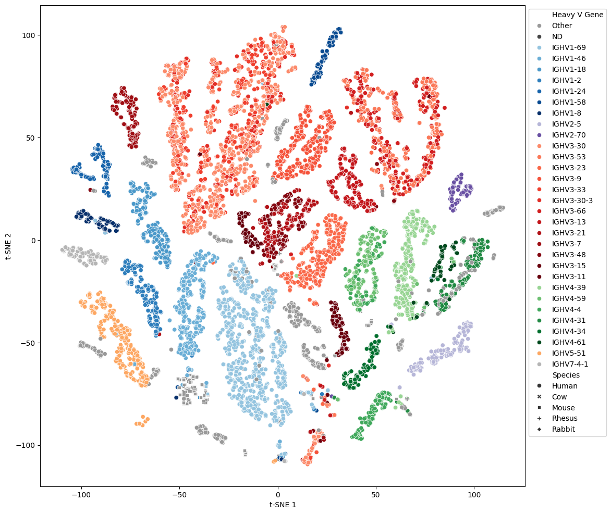

# Sapiens: Human antibody language model

```
    ____              _                
   / ___|  __ _ _ __ (_) ___ _ __  ___ 
   \___ \ / _` | '_ \| |/ _ \ '_ \/ __|
    ___| | |_| | |_| | |  __/ | | \__ \
   |____/ \__,_|  __/|_|\___|_| |_|___/
               |_|                    
```

<p>
</a>
<a href="https://pypi.org/project/sapiens/">
    </a>
<a href="https://github.com/Merck/Sapiens/releases">
    </a>
</p>

Sapiens is a human antibody language model based on BERT.

Learn more in the Sapiens, OASis and BioPhi in our publication:

> David Prihoda, Jad Maamary, Andrew Waight, Veronica Juan, Laurence Fayadat-Dilman, Daniel Svozil & Danny A. Bitton (2022) 
> BioPhi: A platform for antibody design, humanization, and humanness evaluation based on natural antibody repertoires and deep learning, mAbs, 14:1, DOI: https://doi.org/10.1080/19420862.2021.2020203


For more information about BioPhi, see the [BioPhi repository](https://github.com/Merck/BioPhi)

## Features

- Infilling missing residues in human antibody sequences
- Suggesting mutations (in frameworks as well as CDRs)
- Creating vector representations (embeddings) of residues or sequences



## Usage

Install Sapiens using pip:

```bash
# Recommended: Create dedicated conda environment
conda create -n sapiens python=3.8
conda activate sapiens
# Install Sapiens
pip install sapiens
```

❗️ Python 3.7 or 3.8 is currently required due to fairseq bug in Python 3.9 and above: https://github.com/pytorch/fairseq/issues/3535

### Antibody sequence infilling

Positions marked with * or X will be infilled with the most likely human residues, given the rest of the sequence

```python
import sapiens

best = sapiens.predict_masked(
    '**QLV*SGVEVKKPGASVKVSCKASGYTFTNYYMYWVRQAPGQGLEWMGGINPSNGGTNFNEKFKNRVTLTTDSSTTTAYMELKSLQFDDTAVYYCARRDYRFDMGFDYWGQGTTVTVSS',
    'H'
)
print(best)
# QVQLVQSGVEVKKPGASVKVSCKASGYTFTNYYMYWVRQAPGQGLEWMGGINPSNGGTNFNEKFKNRVTLTTDSSTTTAYMELKSLQFDDTAVYYCARRDYRFDMGFDYWGQGTTVTVSS
```

### Suggesting mutations

Return residue scores for a given sequence:

```python
import sapiens

scores = sapiens.predict_scores(
    '**QLV*SGVEVKKPGASVKVSCKASGYTFTNYYMYWVRQAPGQGLEWMGGINPSNGGTNFNEKFKNRVTLTTDSSTTTAYMELKSLQFDDTAVYYCARRDYRFDMGFDYWGQGTTVTVSS',
    'H'
)
scores.head()
#           A         C         D         E  ...
# 0  0.003272  0.004147  0.004011  0.004590  ... <- based on masked input
# 1  0.012038  0.003854  0.006803  0.008174  ... <- based on masked input
# 2  0.003384  0.003895  0.003726  0.004068  ... <- based on Q input
# 3  0.004612  0.005325  0.004443  0.004641  ... <- based on L input
# 4  0.005519  0.003664  0.003555  0.005269  ... <- based on V input
#
# Scores are given both for residues that are masked and that are present. 
# When inputting a non-human antibody sequence, the output scores can be used for humanization.
```

### Antibody sequence embedding

Get a vector representation of each position in a sequence

```python
import sapiens

residue_embed = sapiens.predict_residue_embedding(
    'QVKLQESGAELARPGASVKLSCKASGYTFTNYWMQWVKQRPGQGLDWIGAIYPGDGNTRYTHKFKGKATLTADKSSSTAYMQLSSLASEDSGVYYCARGEGNYAWFAYWGQGTTVTVSS', 
    'H', 
    layer=None
)
residue_embed.shape
# (layer, position in sequence, features)
# (5, 119, 128)
```

Get a single vector for each sequence

```python
seq_embed = sapiens.predict_sequence_embedding(
    'QVKLQESGAELARPGASVKLSCKASGYTFTNYWMQWVKQRPGQGLDWIGAIYPGDGNTRYTHKFKGKATLTADKSSSTAYMQLSSLASEDSGVYYCARGEGNYAWFAYWGQGTTVTVSS', 
    'H', 
    layer=None
)
seq_embed.shape
# (layer, features)
# (5, 128)
```

### Notebooks

Try out Sapiens in your browser using these example notebooks:

<table>
    <tr><th>Links</th><th>Notebook</th><th>Description</th></tr>
    <tr>
        <td>
            <a href="https://mybinder.org/v2/gh/Merck/Sapiens/main?labpath=notebooks%2F01_sapiens_antibody_infilling.ipynb"></a>
        </td>
        <td><a href="notebooks/01_sapiens_antibody_infilling.ipynb">01_sapiens_antibody_infilling</a></td>
        <td>Predict missing positions in an antibody sequence</td>
    </tr>
    <tr>
        <td>
            <a href="https://mybinder.org/v2/gh/Merck/Sapiens/main?labpath=notebooks%2F02_sapiens_antibody_embedding.ipynb"></a>
        </td>
        <td><a href="notebooks/02_sapiens_antibody_embedding.ipynb">02_sapiens_antibody_embedding</a></td>
        <td>Get vector representations and visualize them using t-SNE</td>
    </tr>
</table>


## Acknowledgements

Sapiens is based on antibody repertoires from the Observed Antibody Space:

> Kovaltsuk, A., Leem, J., Kelm, S., Snowden, J., Deane, C. M., & Krawczyk, K. (2018). Observed Antibody Space: A Resource for Data Mining Next-Generation Sequencing of Antibody Repertoires. The Journal of Immunology, 201(8), 2502–2509. https://doi.org/10.4049/jimmunol.1800708
